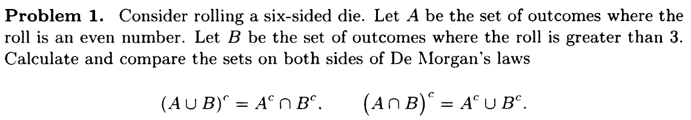
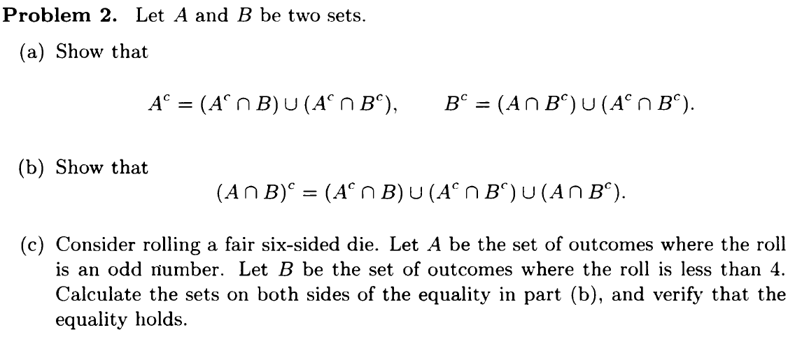
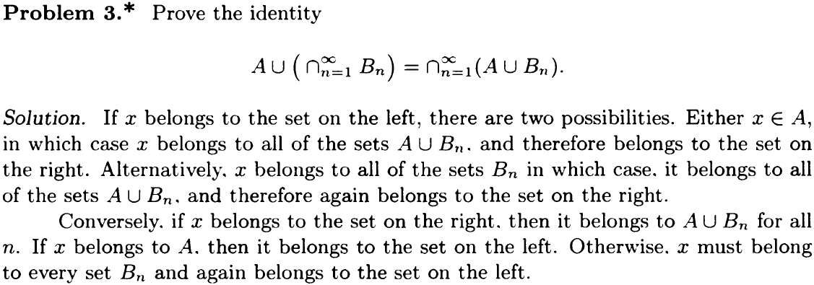
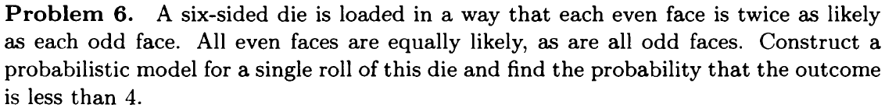
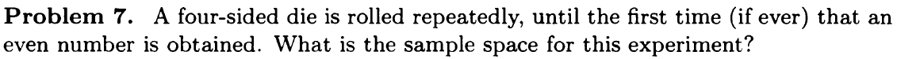
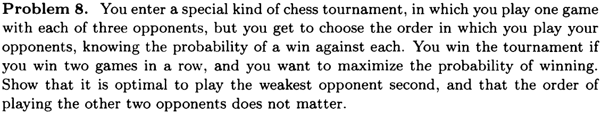
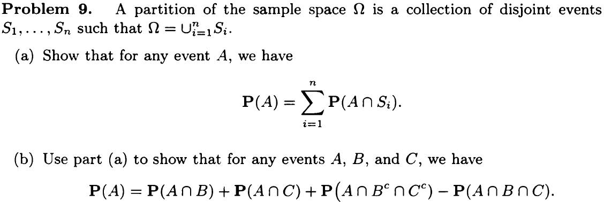
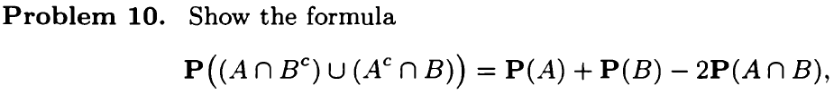
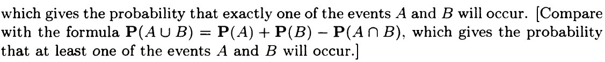

# Probability Models and Axioms {-}

## Recitation Problems {#rcp1 -} 

1. Give a mathematical derivation of the formula
$$ \mathbf{P}((A \cap B^c) \cup (A^c \cap B)) = \mathbf{P}(A) + \mathbf{P}(B) - 2\mathbf{P}(A \cap B)$$
Derivation:
$$\mathbf{P}(A) = \mathbf{P}(A \cap B^c) + \mathbf{P}(A \cap B)$$
$$\mathbf{P}(B) = \mathbf{P}(A^c \cap B) + \mathbf{P}(A \cap B)$$

$A \cap B^c$ and $A^c \cap B$ are disjoint events. Therefore,
$$ \begin{align*}
\mathbf{P}((A \cap B^c) \cup (A^c \cap B)) &= \mathbf{P}(A \cap B^c) + \mathbf{P}(A^c \cap B) \\
&= \mathbf{P}(A) - \mathbf{P}(A \cap B) + \mathbf{P}(B) - \mathbf{P}(A \cap B) \\
&= \mathbf{P}(A) + \mathbf{P}(B) - 2\mathbf{P}(A \cap B)
\end{align*}$$

2. Geniuses and chocolates. Out of the students in a class, 60% are geniuses, 70% love chocolate, and 40% fall into both categories. Determine the probability that a randomly selected student is neither a genius nor a chocolate lover.{#hwks}

Known:
$$\begin{align*}
    &\mathbf{P}(A) = 60\%& \\
    &\mathbf{P}(B) = 70\%& \\ 
    &\mathbf{P}(A \cap B) = 40\%& \\
\end{align*}$$

Thus:
$$\begin{align*}
    \mathbf{P}(A^c \cap B^c) &= \mathbf{P}((A \cup B)^c& \\
    &=\mathbf{P}(\Omega) - \mathbf{P}(A \cap B)& \\
    &=1 - (\mathbf{P}(A) + \mathbf{B} - \mathbf{P}(A \cap B)) &\\
    &=1 - (0.6+0.7-0.4)&\\
    &=0.1&\\
\end{align*}$$

3. A six-sided die is loaded in a way that each even face is twice as likely as each odd face. Construct a probabilistic model for a single roll of this die, and find the probability that a 1, 2, or 3 will come up.

Let 
$$\mathbf{P}(\text{odd}) = x$$
Because even face is twice as likely as each odd face
$$\mathbf{P}(\text{even}) = 2 \cdot \mathbf{P}(\text{odd}) = 2x$$

Use axiom
$$\mathbf{P}(\text{even}) + \mathbf{P}(\text{odd}) = \mathbf{P}(\Omega) = 1$$
Calculate using algebra
$$\begin{align*}
&2x + x = 1 &\\
&x = 1/3 &\\
\end{align*}$$

Plug in value $\mathbf{P}(1) = \mathbf{P}(3) = 1/3$

$$\mathbf{P}(2) = 2/3$$
4. Uniform probabilities on a square. Romeo and Juliet have a date at a given time, and each will arrive at the meeting place with a delay between 0 and 1 hour, with all pairs of delays being “equally likely," that is, according to a uniform probability law on the unit square. The first to arrive will wait for 15 minutes and will leave if the other has not arrived. What is the probability that they will meet?

```{r}
eq1 <- function(x){x+1/4}
eq2 <- function(x){x-1/4}
df <- data.frame(x=c(0, 1))
ggplot(df, aes(x=x)) + 
  stat_function(fun=eq1, aes(), xlim=c(0, 1-1/4), size=1, linetype = "dashed") + 
  stat_function(fun=eq2, aes(), xlim=c(1/4, 1), size=1, linetype = "dashed") +
  geom_segment(aes(x = 0, y = 1, xend = 1, yend = 1), colour = "grey",  size=1, data = df) +
  geom_segment(aes(x = 1, y = 0, xend = 1, yend = 1), colour = "grey",  size=1, data = df) +
  theme_bw() +
  theme(
    legend.position = "none",
    axis.line = element_line(colour = "black", size=1),
    axis.title.x=element_blank(),
    axis.title.y=element_blank(),
    panel.grid.major = element_blank(),
    panel.grid.minor = element_blank(),
    panel.border = element_blank(),
    panel.background = element_blank()) +
  scale_x_continuous(expand = expansion(mult = c(0, 0))) + scale_y_continuous(expand = expansion(mult = c(0, 0)))
```
Event $M$ that Romeo and Juliet will arrive within 15 minutes of each other is
$$ M=\{ (x,y) \bigm\vert \left|x-y\right| \le 1/4, 0 \le x \le 1, 0 \le y \le 1 \}$$
Probability of meeting equals to $\mathbf{P}(M)$ and equals to the area between the two dashed lines, which is $1-3/4 \cdot 3/4 =7/16$ 

5. Bonferroni's inequality.

(a) Prove that for any two events $A_1$ and $A_2$, we have
$$\mathbf{P}(A_1 \cap A_2) \geq \mathbf{P}(A_1) + \mathbf{P}(A_2)-1$$
(b) Generalize to the case of $n$ events $A_1,A_2,\ldots , A_n$, by showing that
$$\mathbf{P}(A_1 \cap A_2 \cap \cdots \cap A_ n)\geq \mathbf{P}(A_1)+\mathbf{P}(A_2)+\cdots +\mathbf{P}(A_ n)-(n-1)$$

##Problems {-}
### Sets {-}
```{r, out.width = '100%'}

```

**Solution**

$$\begin{align*}
&\Omega =\{1, 2, 3, 4, 5, 6\} &\\
\\
&A = \{2, 4, 6\} &\\
&B = \{4, 5, 6\} &\\
\\
&A^c = \{1, 3, 5\} &\\
&B^c = \{1, 2, 3\} &\\
\\
&A^c \cup B^c = \{1, 2, 3, 5\} &\\
&A^c \cap B^c = \{1, 3\} &\\
\\
&A \cup B = \{2, 4, 5, 6\} &\\
&A \cap B = \{4, 6\} &\\
\\
&(A \cup B)^c = \{1, 3\} &\\
&(A \cap B)^c = \{1, 2, 3, 5\}
\end{align*}$$
Therefore:
$$\begin{align*}
&(A \cup B)^c = A^c \cap B^c = \{1, 3\} &\\
&(A \cap B)^c = A^c \cup B^c = \{1, 2, 3, 5\} &\\
\end{align*}$$


```{r, out.width = '100%'}

```
(a) Using $(S \cap T) \cup (S \cap U) = S \cap (T \cup U)$ and let $X = A^c$
$$\begin{align*}
(X \cap B) \cup (X \cap B^c) &= X \cap (B \cup B^c) \\
                             &= X \cap \Omega \\
                             &= X
\end{align*}$$

Plug in $X = A^c \Rightarrow A^c = (A^c \cap B) \cup (A^c \cap B^c)$

(b) From (a), we know $A^c = (A^c \cap B) \cup (A^c \cap B^c)$. Thus

$$\begin{align*}
(A^c \cap B) \cup (A^c \cap B^c) \cup (A \cap B^c) &= X \cap (B \cup B^c) \\
                             &= A^c \cup (A \cap B^c) \\
                             &= (A^c \cup A) \cap (A^c \cup B^c) \\
                             &= \Omega \cap (A^c \cup B^c) \\
                             &= (A^c \cup B^c) \\
                             &= (A \cap B)^c
\end{align*}$$

(c) 

$$\begin{align*}
&\Omega =\{1, 2, 3, 4, 5, 6\} &\\
\\
&A = \{1, 3, 5\} &\\
&B = \{1, 2, 3\} &\\
\\
&A^c = \{2, 4, 6\} &\\
&B^c = \{4, 5, 6\} &\\
\\
&A \cap B = \{1, 3\} &\\
&(A \cap B)^c = \{2, 4, 5, 6\} &\\
&A^c \cap B = \{2\} &\\
&A^c \cap B^c = \{2, 4, 5, 6\} &\\
&A \cap B^c = \{5\} &\\
\\
&\Rightarrow &\\
\\
(A \cap B)^c &= (A^c \cap B) \cup (A^c \cap B^c) \cup (A \cap B^c) \\
             &= \{2\} \cup \{2, 4, 5, 6\} \cup \{5\} \\
             &= \{2, 4, 5, 6\}
\end{align*}$$
```{r, out.width = '100%'}

```

### Probabilistic Models {-}

Problem 5 was solved in [Recitation Problems](#rcp1)

```{r, out.width = '100%'}

```

Experiment: Rolling this six-sided die once.
Outcome: number on the face of the rolled die.
$$ \Omega = \{1, 2, 3, 4, 5, 6\}$$
Let 
$$\begin{align*}
&a = \mathbf{P}(\{1\}) = \mathbf{P}(\{3\}) = \mathbf{P}(\{5\}) &\\
&b = \mathbf{P}(\{2\}) = \mathbf{P}(\{4\}) = \mathbf{P}(\{6\})
\end{align*}$$

Thus,
$$ b = 2a $$

By the additivity and normalization axioms,
$$3a + 3b  = 1$$
$\Rightarrow$

$$\begin{align*}
a = 1/9 \\
b = 2/9
\end{align*}$$
Event outcome is less than 4: $Z= \{x | x \in \Omega\, \text{and} \,  x < 4\} = \{1, 2, 3\}$

$$\begin{align*}
\mathbf{P}(Z) &= \mathbf{P}({1}) + \mathbf{P}({2}) + \mathbf{P}({3}) \\
              &= 1/9 + 2/9 + 1/9 \\
              &= 4/9
\end{align*}$$
```{r, out.width = '100%'}

```

Sample space: the set of all possible outcomes. 

For this question, each outcome is a sequence of numbers for the rolled dies. There are two scenarios:

1. Even number never appeared
In this scenario, outcomes are infinite sequence $$(a_1, a_2, \ldots)$$ with each element belonging to $\{1, 3\}$

2. Even number appeared
In this scenario, outcomes are finite sequence $$(a_1, a_2, \ldots, a_n)$$ where $n$ is an arbitrary positive integer and $a_1, a_2, \ldots, a_{n-1}$ belong $\{1, 3\}$ and $a_n$ belonging to $\{2, 4\}$.

The sample space contains all possible outcomes of the above two scenarios.

```{r, out.width = '100%'}

```

Let $p_i$ be the probability of winning against opponent in the $i$th turn. To win the tournament, you need to win the 2nd round and one of the 1st and 3rd round. The probablity to win the tournament is then
$$p_2(p_1 + (1-p_1)p_3)$$
The order (1, 2, 3) is optimal if and only if the above probablity is no less than the probabilities corresponding to the two alternative orders, i.e.,

$$\begin{align*}
&p_2(p_1 + (1-p_1)p_3) \ge p_1(p_2 + (1-p_2)p_3) &\\
&p_2(p_1 + (1-p_1)p_3) \ge p_3(p_1 + (1-p_1)p_2) &\\
\\
&\Rightarrow \\
\\
&p_2 \ge p_1 &\\
&p_2 \ge p_3
\end{align*}$$
Thus it is optimal to play the weakest opponent second.

```{r, out.width = '100%'}

```

(a)

$$\begin{align*}
A &= A \cap \Omega \\
  &= A \cap \cup^{n}_{i=1}S_i \\
  &= \cup^{n}_{i=1}(A \cap S_i)
\end{align*}$$

Using additivity axioms,
$$\begin{align*}
\mathbf{P}(A) &= \mathbf{P}(\cup^{n}_{i=1}(A \cap S_i)) \\
              &= \sum_{i=1}^{n} \mathbf{P}(A \cap S_i)
\end{align*}$$

(b)

$B \cap C^c$, $B^c \cap C$, $B \cap C$ and $B^c \cap C^c$ are particitions of $\Omega$. Use the conclusion from (a)

$$
\mathbf{P}(A) = \mathbf{P}(A \cap B \cap C^c) + \mathbf{P}(A \cap B^c \cap C) + \mathbf{P}(A \cap B \cap C) + \mathbf{P}(A \cap B^c \cap C^c)
$$

$$\begin{align*}
&A \cap B = (A \cap B \cap C^c) \cup (A \cap B \cap C) &\\
&\mathbf{P}(A \cap B) = \mathbf{P}(A \cap B \cap C^c) + \mathbf{P}(A \cap B \cap C)&\\
&\\
&A \cap C = (A \cap B^c \cap C) \cup (A \cap B \cap C) &\\
&\mathbf{P}(A \cap C) = \mathbf{P}(A \cap B^c \cap C) + \mathbf{P}(A \cap B \cap C)
\end{align*}$$

Plug in the previous equation

$$
\mathbf{P}(A) = \mathbf{P}(A \cap B) + \mathbf{P}(A \cap C) + \mathbf{P}(A \cap B^c \cap C^c) - \mathbf{P}(A \cap B \cap C)
$$
```{r, out.width = '100%'}


```
