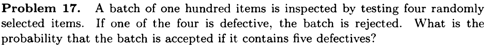
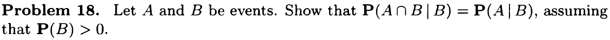
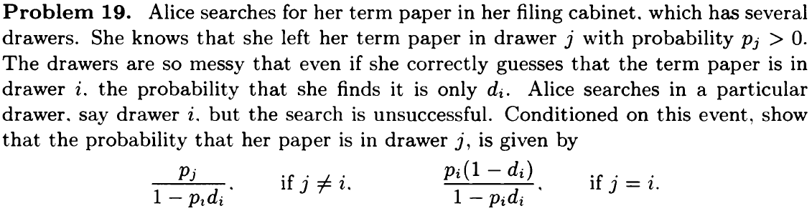
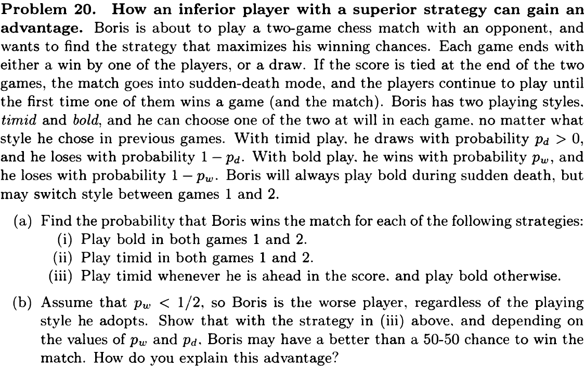
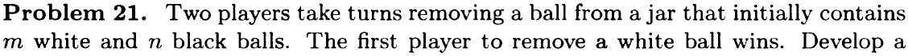
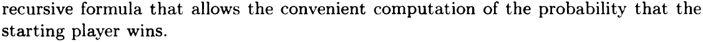
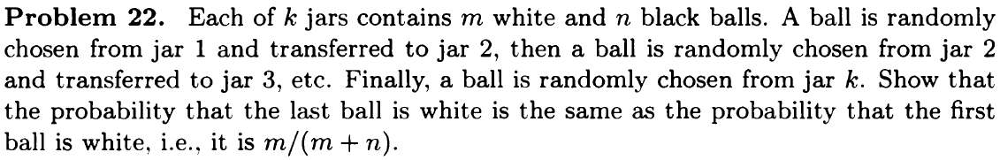

# Conditioning and Independence {-}

## Recitation Problems {#rcp2 -} 

1. Conditional probability example. We roll two fair 6-sided dice. Each one of the 36 possible outcomes is assumed to be equally likely.

(a) Find the probability that doubles are rolled (i.e., both dice have the same number).

(b) Given that the roll results in a sum of 4 or less, find the conditional probability that doubles are rolled.

(c) Find the probability that at least one die roll is a 6.

(d) Given that the two dice land on different numbers, find the conditional probability that at least one die roll is a 6.

**Solutions**

(a) 6/36 = 1/6

(b) 2/6 = 1/3

(c) 11/36

(d) 10/30 = 1/3

2. A chess tournament problem. This year's Belmont chess champion is to be selected by the following procedure. Bo and Ci, the leading challengers, first play a two-game match. If one of them wins both games, he gets to play a two-game second round with Al, the current champion. Al retains his championship unless a second round is required and the challenger beats Al in both games. If Al wins the initial game of the second round, no more games are played.

Furthermore, we know the following:

* The probability that Bo will beat Ci in any particular game is 0.6.
* The probability that Al will beat Bo in any particular game is 0.5.
* The probability that Al will beat Ci in any particular game is 0.7.

Assume no tie games are possible and all games are independent.

Part I. Determine the a priori probabilities that
(a) the second round will be required.
(b) Bo will win the first round.
(c) Al will retain his championship this year.

Part II. Given that the second round is required, determine the conditional probabilities that
(a) Bo is the surviving challenger.
(b) Al retains his championship.

Part III. Given that the second round was required and that it comprised only one game, what is the conditional probability that it was Bo who won the first round?

## Problems {-}
### Conditional Probability {-}
```{r, out.width = '100%'}
knitr::include_graphics("Figs/problem_1_3_16.png")
```

Define events:

* $C_1$: First coin (heads in both faces) was chosen
* $C_2$: Second coin (tails in both faces) was chosen
* $C_3$: Third coni (head/tail) was chosen
* $H$: toss it and result is head

$$\begin{align*}
\mathbf{P}(C_3 \mid H) &= \frac{\mathbf{P}(C_3) \cdot \mathbf{P}(H \mid C_3)}{\mathbf{P}(H)} \\
&= \frac{\mathbf{P}(C_3) \cdot \mathbf{P}(H \mid C_3)}{\sum\limits_{i=1}^{3}\mathbf{P}(C_i) \cdot \mathbf{P}(H \mid C_i)} \\
&= \frac{1/3 \cdot 1/2}{1/3 \cdot 1 + 1/3 \cdot 0 + 1/3 \cdot 1/2} \\
&= 1/3
\end{align*}$$
```{r, out.width = '100%'}

```

Define events:
* $A$: batch is accepted (no defects in all 4 select items)
* $A_i$: ith item has no defect

Using multiplication rule:

$$\begin{align*}
\mathbf{P}(A) &= \mathbf{P}(\cap_{i=1}^4 A_i) \\
             &= \mathbf{P}(A_1)\mathbf{P}(A_2 \mid A_1)\mathbf{P}(A_3 \mid A_1 \cap A_2)\mathbf{P}(A_4 \mid A_1 \cap A_2 \cap A_3 \cap A_4) \\
             &=\frac{95}{100} \cdot \frac{94}{99} \cdot \frac{93}{98} \cdot \frac{92}{97} \\
             &= 0.812
\end{align*}$$

```{r, out.width = '100%'}

```

$$\begin{align*}
\mathbf{P}(A \cap B \mid B) &= \frac{\mathbf{P}(A \cap B \cap B)}{\mathbf{P}(B)} \\
                            &= \frac{\mathbf{P}(A \cap B)}{\mathbf{P}(B)} \\
                            &= \mathbf{P}(A \mid B)
\end{align*}$$

### Total probability theory and Bayes Rule {-}

```{r, out.width = '100%'}

```

Define events:

* $A_j$: paper is in drawer $j$
* $F_j$: Alice searches drawer $j$ and finds the paper
* $N_j$: Alice searches drawer $j$ and does not find the paper


Therefore:

* $\mathbf{P}(A_j) = p_j$
* $\mathbf{P}(A_j^c) = 1-p_j$
* $\mathbf{P}(F_j \mid A_j) = d_j$
* $\mathbf{P}(N_j \mid A_j) = \mathbf{P}(F_j^c \mid A_j) = 1 - d_j$
* $\mathbf{P}(F_j \mid A_j^c) = 0$
* $\mathbf{P}(F_j) = \mathbf{P}(A_j)\mathbf{P}(F_j \mid A_j) + \mathbf{P}(A_j^c)\mathbf{P}(F_j \mid A_j^c) = p_j d_j + 0 = p_j d_j$
* $\mathbf{P}(N_j) = \mathbf{P}(F_j^c) = 1 - p_j d_j$

The question is to calculate $\mathbf{P}(A_j \mid N_i)$

$$\mathbf{P}(A_j \mid N_i) = \frac{\mathbf{P}(A_j)\mathbf{P}(N_i \mid A_j)}{\mathbf{P}(N_i)}$$

$$\begin{equation}
  \mathbf{P}(N_i \mid A_j) = 
    \begin{cases}
      1 & \text{if $i \neq j$}\\
      1 - d_i & \text{if $i = j$}\\
    \end{cases}       
\end{equation}$$


$$\begin{equation}
  \mathbf{P}(A_j \mid N_i) = 
    \begin{cases}
      \dfrac{\mathbf{P}(A_j)}{\mathbf{P}(N_i)} = \dfrac{p_j}{1 - p_i d_i} & \text{if $i \neq j$}
      \\[10pt]
      \dfrac{\mathbf{P}(A_j) \cdot (1 - d_i)}{\mathbf{P}(N_i)} = \dfrac{p_j(1-d_i)}{1 - p_i d_i} & \text{if $i = j$}\\
    \end{cases}       
\end{equation}$$

```{r, out.width = '100%'}

```

(a)

(i) Bold play: $\mathbf{P}_{\text{win}} = p_w^2 + 2(1-p_w)p_w^2 = 3p_w^2 - 2p_w^3$

(ii) Timid play: $\mathbf{P}_{\text{win}} = p_d^2 p_w$

(iii) Switch play: $\mathbf{P}_{\text{win}} = p_w p_d + p_w^2(1-p_d) + p_w^2(1-p_w)$

(b)
For bold play (i), $\mathbf{P}_{\text{win}} = 3p_w^2 - 2p_w^3$ is a monotonically increasing function of $p_w$ for $p_w \in [0, 1]$ ($p_w^2$ changes faster than $p_w^3$ in this range). When $p_w=1/2$, $\mathbf{P}_{\text{win}} = 1/2$. Thus for $p_w < 1/2$, $\mathbf{P}_{\text{win}} < 1/2$. Bois is more likely to lose the game.

For timid play (ii), since $p_d^2 < 1$, $\mathbf{P}_{\text{win}} = p_d^2 p_w < p_w$. If $p_w=1/2$, $\mathbf{P}_{\text{win}} < p_w < 1/2$. Bois is more likely to lose the game.

For switch play (iii), let $p_w = 0.45$ and $p_d = 0.9$
$$\mathbf{P}_{\text{win}} = 0.45 \cdot 0.9 + 0.45^2 \cdot (1-0:9) + 0.45^2 \cdot (1-0.45) \approx 0.54$$
With strategies (i) and (ii), the corresponding probabilities of a win can be calculated
to be approximately 0.43 and 0.36, respectively. What is happening here is that with
strategy (iii), Boris is allowed to select a playing style after seeing the result of the first game, while his opponent is not. Thus, by being able to dictate the playing style in
each game after receiving partial information about the match's outcome, Boris gains
an advantage.

```{r, out.width = '100%'}


```

```{r, out.width = '100%'}

```
